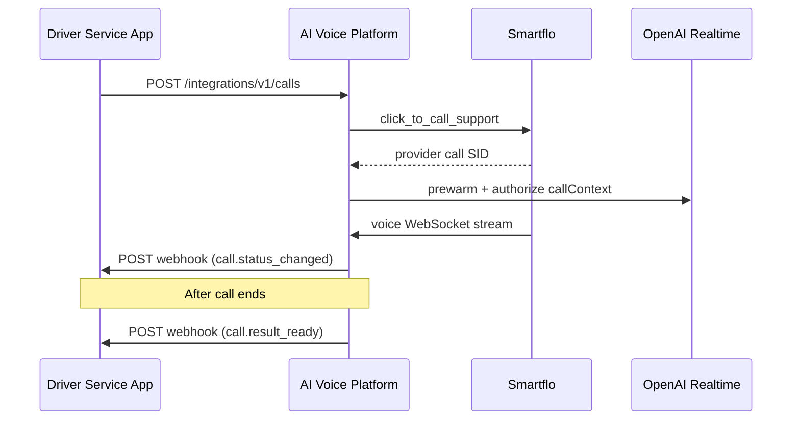

# External Integration API — Initiate Voice Call

Initiate outbound AI voice calls from your driver service using the same payload as the internal `POST /api/voice/test-call` endpoint.

## Authentication

Use an **API key** in the `X-API-Key` header:

```http
X-API-Key: avp_your_secret_key_here
```

Create keys from the admin dashboard (**Settings → Integration API Keys**) or:

```http
POST /api/integrations/api-keys
Authorization: Bearer <admin-jwt-cookie>
Content-Type: application/json

{
  "name": "Driver Service Production",
  "webhookUrl": "https://your-driver-app.com/webhooks/voice",
  "webhookAuthType": "bearer",
  "webhookAuthToken": "your-webhook-secret"
}
```

| Field | Required | Description |
|-------|----------|-------------|
| `name` | Yes | Application/client name these credentials are for |
| `webhookUrl` | No | Webhook URL for status updates and post-call recording + transcript |
| `webhookAuthType` | No | `none` (default), `bearer`, or `header` |
| `webhookAuthHeaderName` | No | Header name when `webhookAuthType` is `header` (default: `X-API-Key`) |
| `webhookAuthToken` | No | Bearer token or header value sent to your callback URL |

Update an existing key (callback URL / auth only — the API key itself cannot be rotated here):

```http
PATCH /api/integrations/api-keys/{id}
Authorization: Bearer <admin-jwt-cookie>
Content-Type: application/json

{
  "webhookUrl": "https://your-driver-app.com/webhooks/voice",
  "webhookAuthType": "header",
  "webhookAuthHeaderName": "X-API-Key",
  "webhookAuthToken": "new-secret"
}
```

The raw integration key is shown **once** on creation. Store it securely. Webhook auth tokens are stored but never returned again in list responses.

### Dev seed key (local only)

After `npm run prisma:seed`:

```
avp_dev_driver_service_key_change_in_production
```

## Call flow



## Initiate call

```http
POST /api/integrations/v1/calls
X-API-Key: avp_...
Content-Type: application/json
```

### Request body

| Field | Required | Description |
|-------|----------|-------------|
| `externalRef` | Yes | Your unique booking/reference ID (idempotency key) |
| `customerNumber` | Yes | 10-digit Indian mobile or `91XXXXXXXXXX` |
| `callContext` | No | Booking/customer details injected into AI runtime |
| `metadata` | No | Opaque JSON stored on the call record |

Webhooks are sent only to the **webhook URL configured on the API key** used to initiate the call. Test calls, campaign calls, and calls from other API keys never share webhook destinations.

### Example — driver service feedback call

```json
{
  "externalRef": "OD482917",
  "customerNumber": "9876543210",
  "callContext": {
    "bookingNumber": "OD482917",
    "customerName": "Rahul Sharma",
    "customerNumber": "9876543210",
    "driverName": "Rajesh Kumar",
    "driverMobileNumber": "9999999999",
    "totalCharges": 450,
    "balanceAmount": 150,
    "paymentMode": "UPI"
  },
  "metadata": {
    "fleetId": "fleet_delhi_01"
  }
}
```

If you omit a webhook URL on the API key, no webhooks are sent for calls from that key.

### `callContext` fields (all optional)

| Field | Example | Used for |
|-------|---------|----------|
| `bookingNumber` | `OD482917` | Opening + AI context |
| `customerName` | `Rahul Sharma` | Greeting by name |
| `customerNumber` | `9876543210` | Reference only |
| `driverName` | `Rajesh Kumar` | Driver issue follow-up |
| `driverMobileNumber` | `9999999999` | Reference only |
| `totalCharges` | `450` | Fare context |
| `balanceAmount` | `150` | Payment follow-up |
| `paymentMode` | `UPI` | Payment context |

If `callContext.bookingNumber` is omitted, `externalRef` is used as the booking reference in AI context.

### Response — success

```json
{
  "idempotent": false,
  "success": true,
  "message": "Integration call initiated successfully",
  "authorizationId": "uuid",
  "providerCallSid": "CAxxxxxxxx",
  "normalizedCustomerNumber": "919876543210",
  "call": {
    "id": "uuid",
    "externalRef": "OD482917",
    "status": "initiated",
    "callPurpose": null,
    "phone": "919876543210",
    "priority": "normal",
    "webhookUrl": "https://your-driver-app.com/webhooks/voice",
    "providerRef": "CAxxxxxxxx",
    "metadata": {
      "callContext": { "...": "..." },
      "providerResponse": { "...": "..." }
    },
    "createdAt": "2026-06-25T10:00:00.000Z",
    "startedAt": "2026-06-25T10:00:00.000Z",
    "endedAt": null,
    "hasTranscript": false,
    "summary": null,
    "sentiment": null
  }
}
```

### Response — idempotent replay

Re-sending the same `externalRef` with the same API key returns the existing call:

```json
{
  "idempotent": true,
  "call": { "...": "..." }
}
```

### Error — Smartflo rejected the call

HTTP `400` with:

```json
{
  "message": "Smartflo click-to-call failed with status 4xx",
  "providerResponse": { "...": "..." }
}
```

## Poll call status

By your booking/reference ID:

```http
GET /api/integrations/v1/calls/ref/OD482917
X-API-Key: avp_...
```

By internal call ID:

```http
GET /api/integrations/v1/calls/{callId}
X-API-Key: avp_...
```

## Webhooks

Webhooks are POST requests to the **webhook URL on the API key that initiated the call**. Each API key only receives data for its own calls.

Every webhook includes:

```http
Content-Type: application/json
X-AI-Voice-Event: <event name>
```

The request URL also includes a UTC timestamp query parameter, for example `?time=20260629143052`.

If configured on the API key, outbound auth is also sent:

| `webhookAuthType` | Header sent to your URL |
|-------------------|-------------------------|
| `bearer` | `Authorization: Bearer <webhookAuthToken>` |
| `header` | `<webhookAuthHeaderName>: <webhookAuthToken>` (default header name: `X-API-Key`) |
| `none` | No extra auth headers |

### Event: `call.status_changed`

Sent when call status changes (e.g. `initiated`, `in_progress`, `completed`).

```json
{
  "callId": "uuid",
  "externalRef": "OD482917",
  "status": "initiated",
  "callPurpose": null,
  "phone": "919876543210",
  "startedAt": "2026-06-25T10:00:00.000Z",
  "endedAt": null,
  "failureReason": null,
  "metadata": {},
  "timestamp": "2026-06-25T10:00:00.000Z"
}
```

### Event: `call.result_ready`

Sent once after the call ends, when the recording is available and the transcript is finalized (or marked failed). Payload uses snake_case field names for direct use in external booking systems.

```json
{
  "booking_number": "100002",
  "customer_name": "Rahul Sharma",
  "customer_mobile_number": "9876543210",
  "driver_name": "Rajesh Kumar",
  "driver_mobile_number": "9999999999",
  "recording_url": "https://your-app.com/api/voice/recordings/MZxxxxxxxx/download",
  "transcripts": "Customer was satisfied with the ride and appreciated the driver's behavior.",
  "call_connected": "1"
}
```

| Field | Source |
|-------|--------|
| `booking_number` | `callContext.bookingNumber`, or `externalRef` if omitted |
| `customer_name` | `callContext.customerName` |
| `customer_mobile_number` | `callContext.customerNumber`, or the dialed call phone (10-digit) |
| `driver_name` | `callContext.driverName` |
| `driver_mobile_number` | `callContext.driverMobileNumber` |
| `recording_url` | Public download URL for the mixed call audio (WAV) |
| `transcripts` | Full flat transcript text |
| `call_connected` | `"1"` when the call connected and completed; `"0"` otherwise |

**Recording download:** `GET` the `recording_url` to fetch the mixed call audio (WAV). The endpoint is public; no API key is required for download.

**Transcript timing:** When post-call transcription is enabled on the platform, `call.result_ready` is sent after transcription completes. If transcription fails, `transcripts` may be empty; the recording is still included.

**Idempotency:** `call.result_ready` is delivered at most once per call.

## curl example

```bash
curl -X POST http://localhost:3000/api/integrations/v1/calls \
  -H "X-API-Key: avp_dev_driver_service_key_change_in_production" \
  -H "Content-Type: application/json" \
  -d '{
    "externalRef": "OD482917",
    "customerNumber": "9876543210",
    "callContext": {
      "bookingNumber": "OD482917",
      "customerName": "Rahul Sharma",
      "driverName": "Rajesh Kumar",
      "totalCharges": 450,
      "balanceAmount": 150,
      "paymentMode": "UPI"
    }
  }'
```

## Interactive API docs

Swagger UI: `http://localhost:3000/api/docs` (production: `https://tatdai.in/api/docs`)

Look under the **Integrations** tag → `POST /integrations/v1/calls`.

## Notes

- Same Smartflo click-to-call path as the admin **Voice Test Call** feature
- `callContext` is passed to OpenAI prewarm and live runtime instructions
- Calls require app authorization (`VOICE_REQUIRE_APP_AUTHORIZATION`) — the integration endpoint registers authorization automatically after Smartflo accepts the call
- Indian mobile numbers only: 10 digits or `91` + 10 digits
- Configure `webhookUrl` when creating the API key in **Settings → Integration API Keys**. Only calls initiated with that key are POSTed to that URL.
