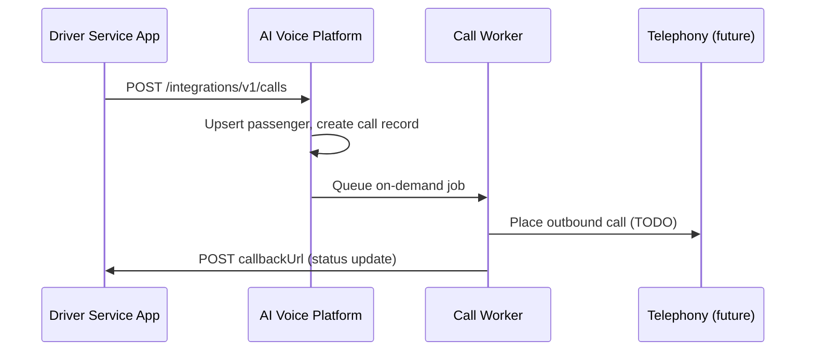

# External Integration API — On-Demand Calls

Push call requests from your driver service (or any external app) into the AI Voice Platform.

## Authentication

Use an **API key** in the `X-API-Key` header:

```http
X-API-Key: avp_your_secret_key_here
```

Create keys from the admin dashboard (**Settings → Integration API Keys**) or:

```http
POST /api/integrations/api-keys
Authorization: Bearer <admin-jwt-cookie>
{ "name": "Driver Service Production" }
```

The raw key is shown **once** on creation. Store it securely.

### Dev seed key (local only)

After `npm run prisma:seed`:

```
avp_dev_driver_service_key_change_in_production
```

## On-demand call flow



## Request on-demand call

```http
POST /api/integrations/v1/calls
X-API-Key: avp_...
Content-Type: application/json
```

### Example — driver assigned

```json
{
  "externalRef": "trip_9f3a21",
  "callPurpose": "driver_assigned",
  "priority": "high",
  "callbackUrl": "https://your-driver-app.com/webhooks/voice-status",
  "passenger": {
    "phone": "+15551234567",
    "firstName": "Alex",
    "lastName": "Rivera",
    "language": "en"
  },
  "driver": {
    "name": "Sam Taylor",
    "phone": "+15559876543",
    "vehicleId": "VH-204",
    "vehiclePlate": "ABC-1234"
  },
  "trip": {
    "pickupAddress": "123 Main St, Austin, TX",
    "dropoffAddress": "456 Oak Ave, Austin, TX",
    "scheduledPickupAt": "2026-06-08T18:30:00Z",
    "estimatedArrival": "2026-06-08T18:42:00Z",
    "fare": "24.50",
    "currency": "USD"
  },
  "metadata": {
    "fleetId": "fleet_austin_01",
    "rideType": "standard"
  }
}
```

### Call purposes

| Value | Use case |
|-------|----------|
| `driver_assigned` | Driver matched to trip |
| `ride_reminder` | Upcoming pickup reminder |
| `pickup_update` | ETA or location change |
| `trip_completed` | Post-ride follow-up |
| `payment_reminder` | Payment due |
| `custom` | Generic scripted call |

### Response

```json
{
  "idempotent": false,
  "call": {
    "id": "uuid",
    "externalRef": "trip_9f3a21",
    "status": "queued",
    "callPurpose": "driver_assigned",
    "phone": "+15551234567",
    "priority": "high",
    "metadata": { "...": "..." },
    "createdAt": "2026-06-08T18:25:00.000Z"
  }
}
```

**Idempotency:** Re-sending the same `externalRef` with the same API key returns the existing call (`idempotent: true`).

## Poll call status

By your trip/booking ID:

```http
GET /api/integrations/v1/calls/ref/trip_9f3a21
X-API-Key: avp_...
```

By internal call ID:

```http
GET /api/integrations/v1/calls/{callId}
X-API-Key: avp_...
```

## Status callbacks

If you provide `callbackUrl`, the platform POSTs on status changes:

```json
{
  "callId": "uuid",
  "externalRef": "trip_9f3a21",
  "status": "initiated",
  "callPurpose": "driver_assigned",
  "phone": "+15551234567",
  "startedAt": "2026-06-08T18:25:01.000Z",
  "endedAt": null,
  "failureReason": null,
  "metadata": {},
  "timestamp": "2026-06-08T18:25:01.000Z"
}
```

Header: `X-AI-Voice-Event: call.status_changed`

## curl example

```bash
curl -X POST http://localhost:3000/api/integrations/v1/calls \
  -H "X-API-Key: avp_dev_driver_service_key_change_in_production" \
  -H "Content-Type: application/json" \
  -d '{
    "externalRef": "trip_demo_001",
    "callPurpose": "driver_assigned",
    "passenger": { "phone": "+15551234567", "firstName": "Alex" },
    "driver": { "name": "Sam", "vehiclePlate": "XYZ-999" },
    "trip": { "pickupAddress": "Airport Terminal 1" }
  }'
```

## Notes

- Works without Redis (`REDIS_ENABLED=false`) — calls process inline
- Telephony provider is still a placeholder; call records and AI context are created
- Passenger is auto-created/updated in the customers table by phone number
